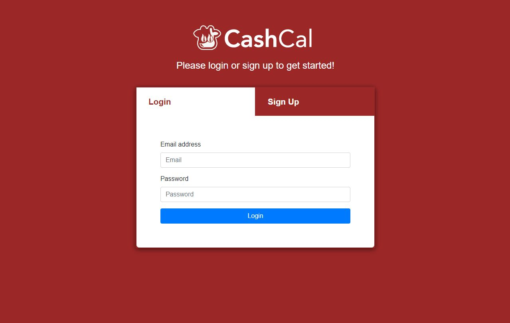
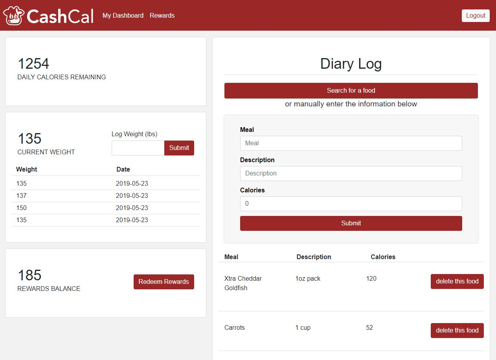

***

CashCal is a full stack application created using `React`, `Express`, `Node` and `MySQL`.
A play on the phrase “cash cow”, CashCal is a Calorie and Weight Tracker app driven by incentive. An ideal CashCal user would be someone looking to keep track of their weight and eating habits _but_ maybe needs some incentive or motivation to do so. Users earn rewards points when they sign up, log their weight and for each entry that is made into their diary log. Rewards points can then be redeemed for real-world rewards like giftcards and discounts.

Click [here](https://polar-tor-81214.herokuapp.com/) to view the deployed app on Heroku.

## Screen Shots
Home

Dashboard

Rewards

## Created by (Roles):
* [`Chris Cass`](https://github.com/crcass) - (Backend, Component functionality)
* [`Renee Hickman`](https://github.com/reneehickman) - (Project Structure/Component Setup, Compiling, Design, Styling)
* [`Taylor Stiger`](https://github.com/TaylorFStiger) - (Food Search API in Diary Component)
* [`Sally Alrawi`](https://github.com/sallyalrawi) - (Firebase Authentication)

## Technnologies Used:
- React
- React-Bootstrap
- React-DOM
- React-Router
- NodeJS
- Express 
- Axios
- MySQL Database
- Babel
- Sequelize ORM
- USDA Nutrition Database API
- Firebase Authentication
